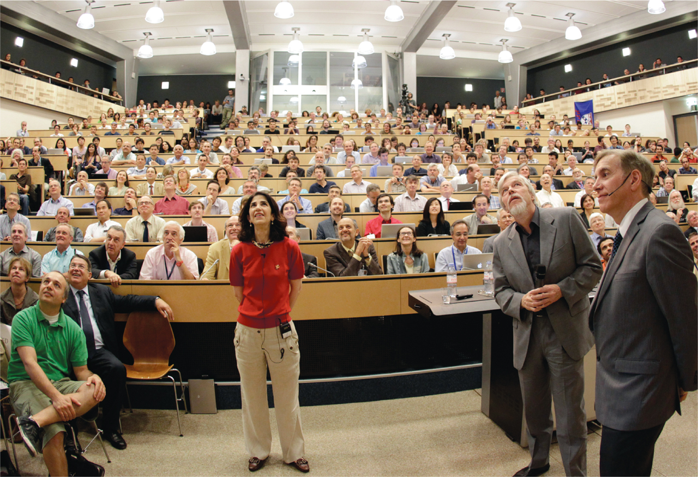

> ## Will you make the next big discovery?
> 
> Image from [Science magazine](https://science.sciencemag.org/content/337/6091/141)
{: .testimonial}

You have formulated a new theory that predicts a brand new particle! You call this
particle an ***ULTIMATON***

You calculate that the most likely decay of an ultimaton is to two (2) same-sign
charged leptons and two (2) jets of any flavour. The predicted mass is in the 300-500 GeV/c^2 
range and you plan on going looking for it in the CMS Open Data!

Let's see what you'll need. Consider only the 2012 run period.

> ## Triggers
>
> What triggers are most sensitive to this process? How many records are there for each of the triggers
> you are interested in? How many events?
> 
{: .challenge}

> ## Background
> What Standard Model processes might contribute to the background? Are there any simulation samples that
can help you study this? 
> 
> Remind yourself of the following:
> * What does the top-quark decay to? 
> * What does a W boson decay to?
> * What does a Z boson decay to? 
> * What is the Drell-Yan process?
>
> Do you think any of these process are significant? Can any be ignored? 
> 
> Look at the Standard Model samples. Do you see any of these processes in there? 
{: .challenge}

> ## Is this background? 
> Consider [this sample](http://opendata.cern.ch/record/9605). What process is this? Could this 
be a significant background, if the cross section is large?
{: .challenge}


